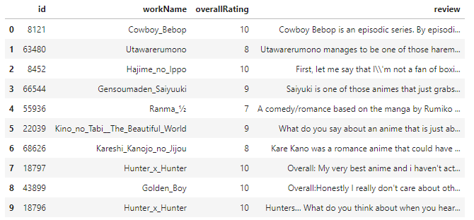

# CSI4106 Project - Sentiment Analysis on reviews from MyAnimeList

## Goal
The purpose of this project is to create models that can classify the sentiment off of a review based purely on the review. This project will allow us to explore and compare several different predictive models as well as explore different encoding techniques for textual data.

## Dataset
The data can be found on https://www.kaggle.com/natlee/myanimelist-comment-dataset. It is not provided in the repo as it is too large to push.

